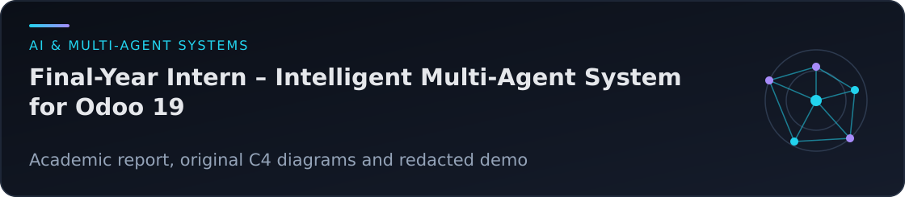
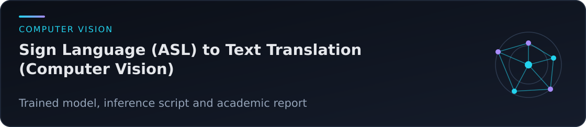
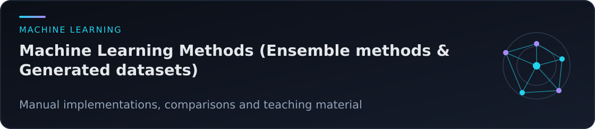

[About](#about) · [Featured work](#featured-work) · [All projects](#all-projects) · [Tools](#tools) · [Contact](#contact)

## About

I hold a Master's degree in **Intelligent Systems Engineering** and a Bachelor's degree in **Mathematics and Computer Science** from Ibn Tofail University, Morocco.

My work brings together mathematical methods and practical software: machine learning, computer vision, multi-agent systems, knowledge graphs and application development. During my final-year internship, I developed a contextual multi-agent assistant integrated into Odoo.

This portfolio brings together academic projects and reviewed internship documentation. Each repository describes its available material, contributors, verification results and limitations.

## Featured work

The Odoo repository publishes academic documentation and a redacted demonstration; its professional implementation is not distributed. The ASL project classifies isolated static alphabet images. The ensemble implementations are educational comparisons rather than production estimators.

## All projects

| Project | Available focus |
|---|---|
| [Automatic Knowledge-Graph Construction from Tabular Data (Semantic Web & XML)](https://github.com/adamelakkaoui/automatic-knowledge-graph-construction-from-tabular-data-semantic-web-xml) | RDF conversion, anonymised example and academic article |
| [Sign Language (ASL) to Text Translation (Computer Vision)](https://github.com/adamelakkaoui/sign-language-asl-to-text-translation-computer-vision) | CNN model, image inference and report |
| [Checkers Game with Logic Rules – Python](https://github.com/adamelakkaoui/checkers-game-with-logic-rules-python) | Minimax, alpha-beta pruning, code and tests |
| [Predicting Metacritic Scores from IMDb Data – Python, ML](https://github.com/adamelakkaoui/predicting-metacritic-scores-from-imdb-data-python-ml) | Regression notebook and synthetic-data analysis |
| [Network Segmentation in a Small Company – Cisco Packet Tracer](https://github.com/adamelakkaoui/network-segmentation-in-a-small-company-cisco-packet-tracer) | Packet Tracer topology and case study |
| [Metaheuristic Optimisation Algorithms (ILS)](https://github.com/adamelakkaoui/metaheuristic-optimisation-algorithms-ils) | ILS implementation, small TSP example and tests |
| [Machine Learning Methods (Ensemble methods & Generated datasets)](https://github.com/adamelakkaoui/machine-learning-methods-ensemble-methods-generated-datasets) | Manual ensembles, Diabetes comparisons and synthetic generation |
| [Stock Management System – Python](https://github.com/adamelakkaoui/stock-management-system-python) | Text-file and SQLite implementations with tests |
| [University Library Management System (Bachelor's final project)](https://github.com/adamelakkaoui/university-library-management-system-bachelors-final-project) | Koha customisation samples and reviewed documents |
| [Autonomous Mobile Robot (TinkerCad, C)](https://github.com/adamelakkaoui/autonomous-mobile-robot-tinkercad-c) | Arduino code and potentiometer-control simulation |
| [Road Traffic Simulation MAS (Multi-Agent Systems)](https://github.com/adamelakkaoui/road-traffic-simulation-mas-multi-agent-systems) | NetLogo model, report, presentation and video |
| [Online Shop with Landing Page – PrestaShop, WordPress](https://github.com/adamelakkaoui/online-shop-with-landing-page-prestashop-wordpress) | ADAMSHOP23 documentary video |
| [Final-Year Intern – Intelligent Multi-Agent System for Odoo 19](https://github.com/adamelakkaoui/final-year-intern-intelligent-multi-agent-system-for-odoo-19) | Academic report, C4 diagrams and redacted video |

## Tools

- **Programming and data:** Python, NumPy, pandas, SQL and SQLite.
- **Machine learning and vision:** scikit-learn, TensorFlow/Keras and OpenCV.
- **AI applications:** FastAPI, LangGraph, LangChain, ChromaDB and Sentence Transformers.
- **Knowledge representation and systems:** RDFLib, NetLogo, Arduino/Tinkercad, Cisco Packet Tracer and Koha.
- **Web applications:** Odoo/OWL, JavaScript, PrestaShop and WordPress.

These tools reflect the projects in this portfolio; their depth and validation scope are described in the individual repositories.

## Contact

[Email](mailto:adam.elakkaoui@uit.ac.ma) · [LinkedIn](https://www.linkedin.com/in/adam-el-akkaoui-7b6660273/) · [GitHub](https://github.com/adamelakkaoui)

Reports and presentations are mainly in French; the repository documentation is in English.
