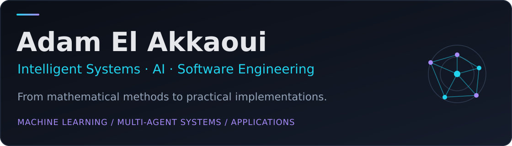

[About](#about) · [Education](#education) · [Technical domains](#technical-domains) · [Internship](#internship) · [Projects](#projects) · [Languages and certifications](#languages-and-certifications) · [Contact](#contact)

## About

I am a **Master’s graduate in Intelligent Systems Engineering** from Ibn Tofail University in Kénitra, Morocco, with a background in **Mathematics and Computer Science**. I enjoy problems that require understanding the underlying theory and turning it into a working implementation.

My training connects artificial intelligence, machine learning, multi-agent systems, optimisation, data analysis, software and web development, networks and cloud computing. I learn by building, comparing approaches and documenting methods, results and design decisions clearly.

During my final-year internship at **Maxware Technology**, I carried a contextual multi-agent assistant for **Odoo 19** from requirements analysis through architecture, implementation, testing and evaluation. My academic projects range from manual ensemble algorithms and knowledge graphs to computer vision, simulation and application development.

This portfolio is relevant to software and AI roles, research opportunities and technical collaboration. Project READMEs preserve team credits and bring together the available code, reports, presentations, demonstrations, results and project scope.

## Education

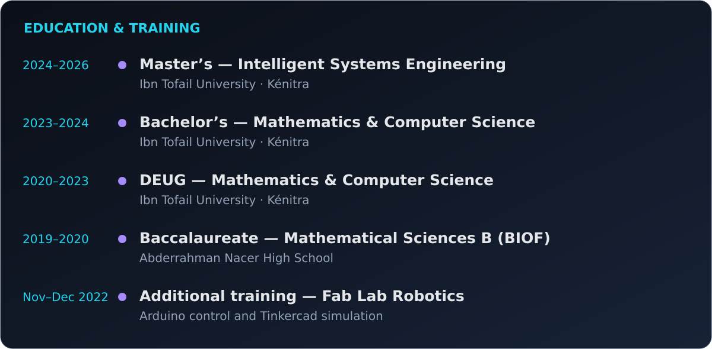

Academic focus and learning approach

My Master’s modules included logic programming, probability and statistics for AI, metaheuristic optimisation, machine learning, deep learning and NLP, computer vision, multi-agent systems, semantic web, parallel/distributed programming, networks and security, and cloud computing/virtualisation. Coursework exposure and project implementation are identified separately below.

I value autonomy, teamwork, patience and clear explanations. Several academic projects were collaborative; contributors are credited in their repositories.

## Technical domains

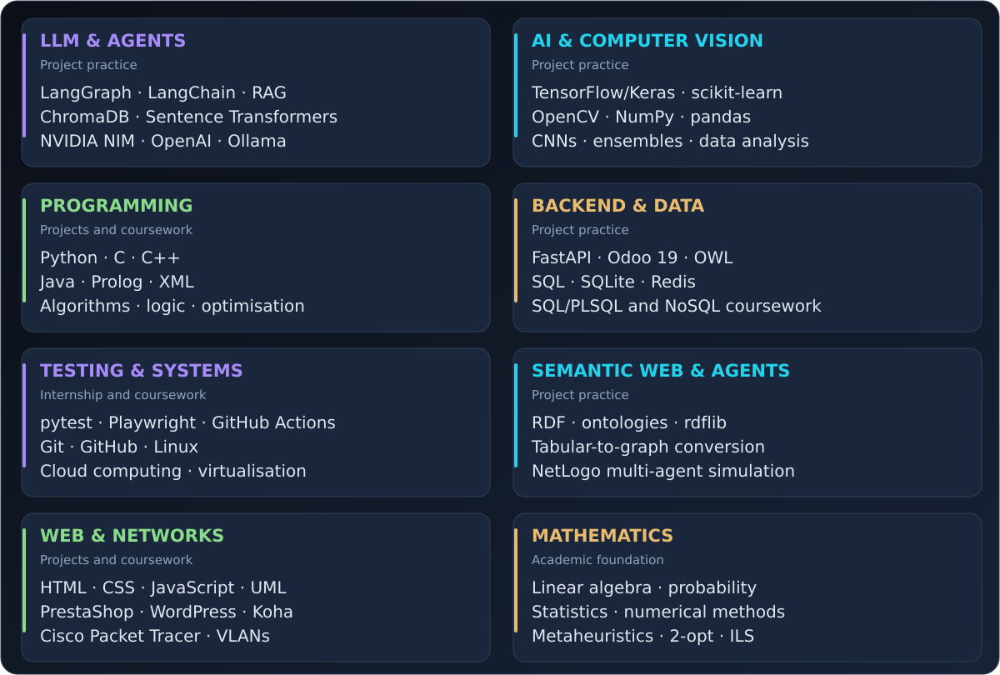

The board distinguishes hands-on project practice from broader academic exposure.

## Internship

**Final-Year Intern – Intelligent Multi-Agent System for Odoo 19**  
**Maxware Technology · Kénitra, Morocco · Hybrid · March–July 2026**

The project addresses ERP learning friction: users need help that understands their current screen, retrieves relevant documentation and explains what to do next. The documented solution combines **eight specialised agents**, a **LangGraph** orchestration graph, a **FastAPI** backend, an **OWL** interface and a **RAG** pipeline using **ChromaDB** and **Sentence Transformers**.

Its capabilities include contextual explanations, visual step-by-step guidance, adaptive quizzes using SM-2, multilingual assistance and streamed responses. The project evaluation covered twelve Odoo modules and 65 question/document pairs, with Precision@5 of **0.843** and MRR of **0.973**. The engineering workflow also included **294 automated CI tests** and five end-to-end Playwright flows.

[**Explore the illustrated case study →**](https://github.com/adamelakkaoui/final-year-intern-intelligent-multi-agent-system-for-odoo-19) · [French report](https://github.com/adamelakkaoui/final-year-intern-intelligent-multi-agent-system-for-odoo-19/blob/main/docs/academic-report-fr.pdf) · [Defence presentation](https://github.com/adamelakkaoui/final-year-intern-intelligent-multi-agent-system-for-odoo-19/blob/main/presentations/odoo-mas-defense-fr.pptx) · [Redacted demonstration](https://github.com/adamelakkaoui/final-year-intern-intelligent-multi-agent-system-for-odoo-19/releases/tag/academic-demo)

## Projects

All project titles below match my CV. Click a card to open its code, reports, presentations, demonstrations and documented project results.

<table>
<tr>
<td width="50%" valign="top"><a href="https://github.com/adamelakkaoui/final-year-intern-intelligent-multi-agent-system-for-odoo-19">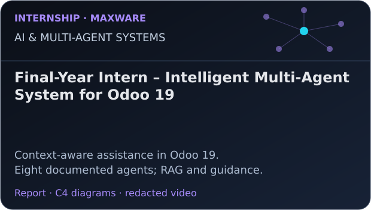</a></td>
<td width="50%" valign="top"><a href="https://github.com/adamelakkaoui/automatic-knowledge-graph-construction-from-tabular-data-semantic-web-xml">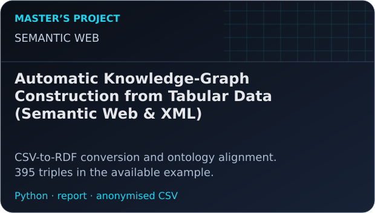</a></td>
</tr>
<tr>
<td width="50%" valign="top"><a href="https://github.com/adamelakkaoui/sign-language-asl-to-text-translation-computer-vision">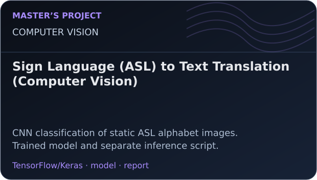</a></td>
<td width="50%" valign="top"><a href="https://github.com/adamelakkaoui/road-traffic-simulation-mas-multi-agent-systems">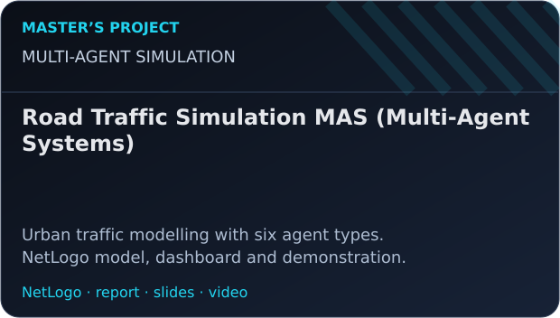</a></td>
</tr>
<tr>
<td width="50%" valign="top"><a href="https://github.com/adamelakkaoui/checkers-game-with-logic-rules-python">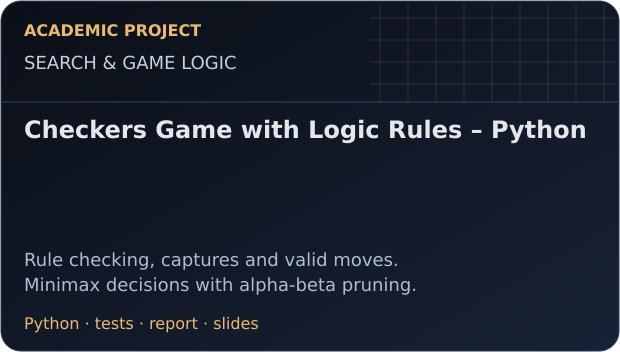</a></td>
<td width="50%" valign="top"><a href="https://github.com/adamelakkaoui/predicting-metacritic-scores-from-imdb-data-python-ml">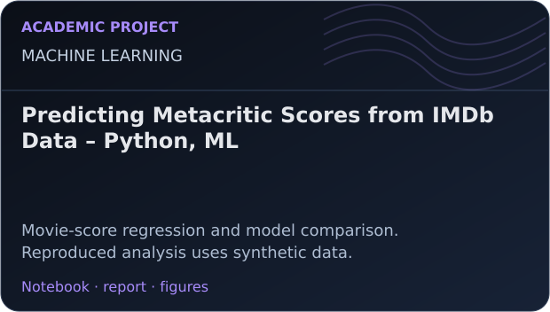</a></td>
</tr>
<tr>
<td width="50%" valign="top"><a href="https://github.com/adamelakkaoui/network-segmentation-in-a-small-company-cisco-packet-tracer">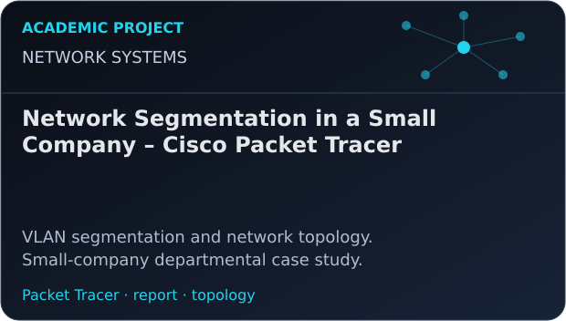</a></td>
<td width="50%" valign="top"><a href="https://github.com/adamelakkaoui/stock-management-system-python">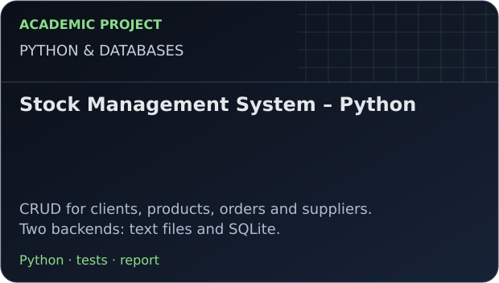</a></td>
</tr>
<tr>
<td width="50%" valign="top"><a href="https://github.com/adamelakkaoui/university-library-management-system-bachelors-final-project">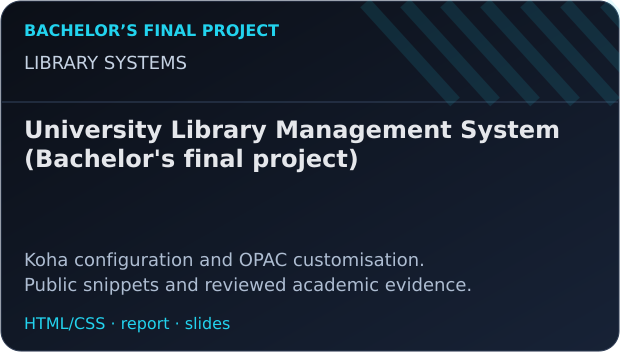</a></td>
<td width="50%" valign="top"><a href="https://github.com/adamelakkaoui/autonomous-mobile-robot-tinkercad-c">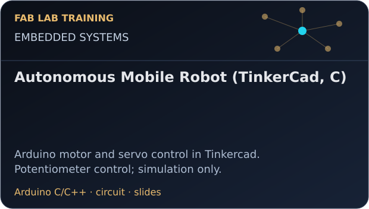</a></td>
</tr>
<tr>
<td width="50%" valign="top"><a href="https://github.com/adamelakkaoui/metaheuristic-optimisation-algorithms-ils">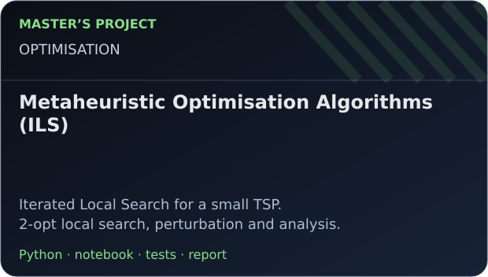</a></td>
<td width="50%" valign="top"><a href="https://github.com/adamelakkaoui/online-shop-with-landing-page-prestashop-wordpress">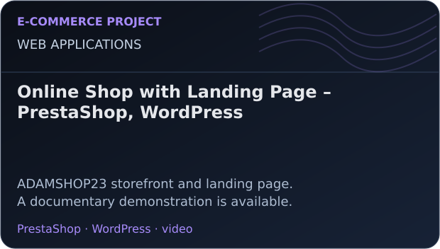</a></td>
</tr>
<tr>
<td width="50%" valign="top"><a href="https://github.com/adamelakkaoui/machine-learning-methods-ensemble-methods-generated-datasets">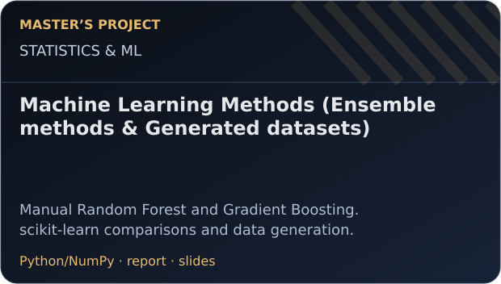</a></td>
<td width="50%" valign="top">Reports and presentations are mainly in French; repository explanations are in English. Each project states its scope and limitations.</td>
</tr>
</table>

Project index — searchable titles and technical focus

| Project | Focus |
|---|---|
| [Final-Year Intern – Intelligent Multi-Agent System for Odoo 19](https://github.com/adamelakkaoui/final-year-intern-intelligent-multi-agent-system-for-odoo-19) | Context-aware assistance in Odoo 19 with eight specialized agents, RAG, visual guidance and adaptive learning. |
| [Automatic Knowledge-Graph Construction from Tabular Data (Semantic Web & XML)](https://github.com/adamelakkaoui/automatic-knowledge-graph-construction-from-tabular-data-semantic-web-xml) | CSV-to-RDF conversion and ontology alignment. 395 triples in the available example. |
| [Sign Language (ASL) to Text Translation (Computer Vision)](https://github.com/adamelakkaoui/sign-language-asl-to-text-translation-computer-vision) | CNN classification of static ASL alphabet images with real-time webcam recognition through OpenCV. |
| [Road Traffic Simulation MAS (Multi-Agent Systems)](https://github.com/adamelakkaoui/road-traffic-simulation-mas-multi-agent-systems) | Urban traffic modelling with six agent types. NetLogo model, dashboard and demonstration. |
| [Checkers Game with Logic Rules – Python](https://github.com/adamelakkaoui/checkers-game-with-logic-rules-python) | Rule checking, captures and valid moves. Minimax decisions with alpha-beta pruning. |
| [Predicting Metacritic Scores from IMDb Data – Python, ML](https://github.com/adamelakkaoui/predicting-metacritic-scores-from-imdb-data-python-ml) | Movie-score regression from IMDb attributes, with data preparation, feature engineering, model comparison and score prediction. |
| [Network Segmentation in a Small Company – Cisco Packet Tracer](https://github.com/adamelakkaoui/network-segmentation-in-a-small-company-cisco-packet-tracer) | VLAN segmentation and network topology. Small-company departmental case study. |
| [Stock Management System – Python](https://github.com/adamelakkaoui/stock-management-system-python) | CRUD for clients, products, orders and suppliers. Two backends: text files and SQLite. |
| [University Library Management System (Bachelor's final project)](https://github.com/adamelakkaoui/university-library-management-system-bachelors-final-project) | Koha configuration and OPAC customisation. Public snippets and reviewed academic evidence. |
| [Autonomous Mobile Robot (TinkerCad, C)](https://github.com/adamelakkaoui/autonomous-mobile-robot-tinkercad-c) | Arduino motor and servo control in Tinkercad. Potentiometer control; simulation only. |
| [Metaheuristic Optimisation Algorithms (ILS)](https://github.com/adamelakkaoui/metaheuristic-optimisation-algorithms-ils) | Iterated Local Search for a small TSP. 2-opt local search, perturbation and analysis. |
| [Online Shop with Landing Page – PrestaShop, WordPress](https://github.com/adamelakkaoui/online-shop-with-landing-page-prestashop-wordpress) | ADAMSHOP23 storefront and landing page. A documentary demonstration is available. |
| [Machine Learning Methods (Ensemble methods & Generated datasets)](https://github.com/adamelakkaoui/machine-learning-methods-ensemble-methods-generated-datasets) | Manual Random Forest and Gradient Boosting. scikit-learn comparisons and data generation. |

## Languages and certifications

<table>
<thead>
<tr>
<th width="160">Language</th>
<th>Background</th>
</tr>
</thead>
<tbody>
<tr>
<td>&nbsp;Arabic</td>
<td>Native</td>
</tr>
<tr>
<td>&nbsp;French</td>
<td>Professional proficiency</td>
</tr>
<tr>
<td>&nbsp;English</td>
<td>EF SET overall <strong>75/100 — C2</strong>, August 2026</td>
</tr>
<tr>
<td>&nbsp;German</td>
<td>Completed B1 coursework at Friedrich Rückert Zentrum, Kénitra; nearing completion of B2 coursework; no formal proficiency certificate</td>
</tr>
</tbody>
</table>

### English certificate

**EF SET — 75/100, C2 overall** · Issued **27 August 2026**.

[**View the original certificate (PDF)**](certificates/ef-set-english-certificate.pdf) · [Verify on EF SET](https://cert.efset.org/fr/fR1YtL)

### Oracle certifications

Original badges from my portfolio, linked to the corresponding Oracle eCertificates.

<table>
<tr>
<td width="33%" align="center" valign="top">
 
<strong>OCI 2025 — AI Foundations Associate</strong> 
Issued 6 August 2025 · Valid until 6 August 2027 
<a href="certificates/oracle-ai-foundations.pdf">View certificate (PDF)</a>
</td>
<td width="33%" align="center" valign="top">
 
<strong>OCI 2025 — Foundations Associate</strong> 
Issued 5 August 2025 · Valid until 5 August 2027 
<a href="certificates/oracle-foundations.pdf">View certificate (PDF)</a>
</td>
<td width="33%" align="center" valign="top">
<a href="certificates/oracle-data-platform.pdf">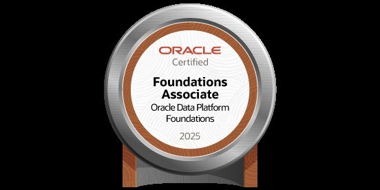</a> 
<strong>Oracle Data Platform 2025 — Foundations Associate</strong> 
Issued 8 August 2025 
<a href="certificates/oracle-data-platform.pdf">View certificate (PDF)</a>
</td>
</tr>
</table>

## Contact

**Kénitra, Morocco** · Open to AI/software opportunities, research and collaboration.

[Email — adam.elakkaoui@uit.ac.ma](mailto:adam.elakkaoui@uit.ac.ma) · [LinkedIn](https://www.linkedin.com/in/adam-el-akkaoui-7b6660273/) · [GitHub](https://github.com/adamelakkaoui)
